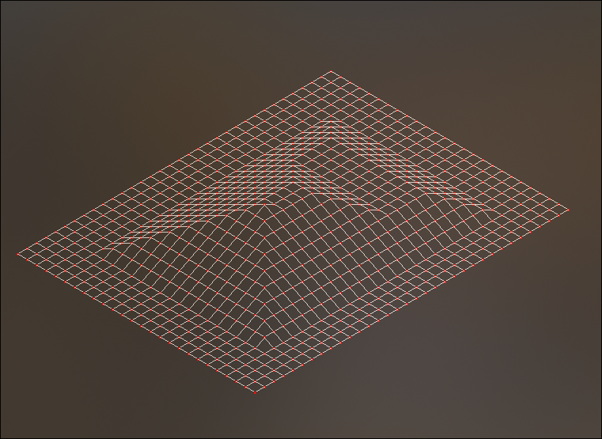
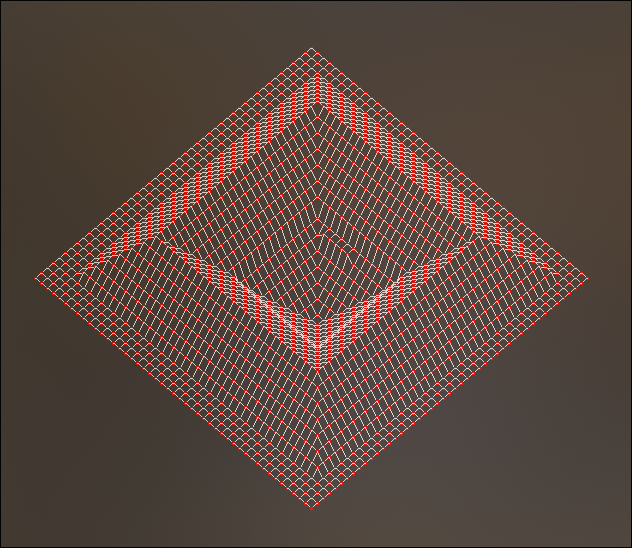

# fdf

Aka "fil de fer" or wireframe model.
This project is about creating a small engine rendering isometric projection of forms, defined in `.fdf` files (some can be found in the [maps](./maps).

## Example

Here are some examples with some maps:

You can then, when started (and when loaded `fdf` file), edit the scale of the height with UP and DOWN arrow keys. You can also quit with ESC.

Some given maps still leads to segfault, but their size is the problem.
